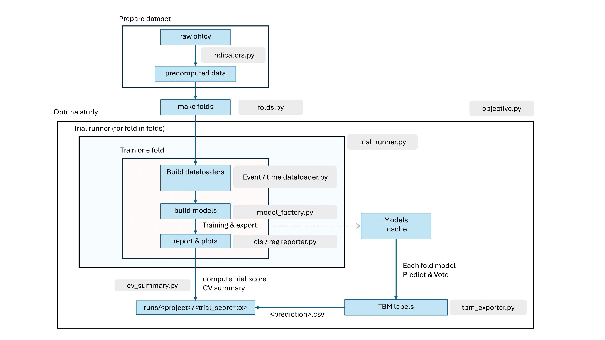

# Crypto-Quant Train Pipeline

## 1. 專案架構
```
train/
├── main_train.py
├── config.yaml
├── core/
│   ├── config_loader.py
│   ├── context.py
│   └── orchestrator.py
├── data/
│   ├── column_plan.py
│   ├── folds.py
│   ├── labeling.py
│   ├── dataloaders/
│   │   ├── base.py
│   │   ├── event_loader.py
│   │   └── time_loader.py
│   ├── dataset/
│   │   ├── event_dataset.py
│   │   └── time_dataset.py
│   └── features/
│       ├── features_config.yaml
│       └── indicators.py
├── evaluation/
│   ├── utils.py
│   ├── exporters/
│   │   ├── cv_summary.py
│   │   └── tbm_exporter.py
│   └── reporters/
│       ├── classification_reporter.py
│       └── regression_reporter.py
├── models/
│   ├── model_factory.py
│   ├── registry.py
│   ├── LSTM.py
│   ├── transformer_model.py
│   ├── two_stream_model.py
│   └── xgb_model.py
├── pipeline/
│   ├── trial_runner.py
│   └── search/
│       ├── objective.py
│       └── space.py
├── inference/
│   └── predictor.py
├── test_case/
│   ├── predictor_testing.py
│   └── predictor.yaml
├── training/
│   ├── hooks.py
│   ├── losses/
│   │   ├── cls.py
│   │   └── reg.py
│   ├── metrics/
│   │   ├── metrics_cls.py
│   │   └── metrics_reg.py
│   └── trainers/
│       ├── classification.py
│       ├── regression.py
│       ├── utils.py
│       └── xgb.py
├── train_utils/
│   ├── analysis.py
│   ├── label.py
│   └── random_alpha_generator/
│       ├── node.py
│       └── random_alpha_generator.py
└── export_model/
    └── README.md

```


1. `train/core` 讀取設定、設定隨機種子，再呼叫 `main_train.run_single`。
2. `train/pipeline/search/objective` 為 Optuna 目標函式，管理超參搜尋、fold 建立與 TrialRunner。
3. `TrialRunner` 組合資料載入、模型建立與 trainer，收集每個 fold 的結果與產物。
4. `train/evaluation` 封裝圖表與匯出邏輯，集中在 TrialRunner 內觸發，最後寫入 `runs/<project>/`。
5. `train/inference/predictor.py`：獨立推論用的 Predictor，支援多 checkpoint 投票與 CSV 輸出（TrialRunner post-infer 也會呼叫）。


## 2. 模組說明
### 0. `train/` 頂層
```
train/
├── main_train.py
├── config.yaml
```
| 路徑 | 說明 |
| ---- | ---- |
| `main_train.py` | Pipeline 入口。讀取 config => 建立 Optuna Study 並執行搜尋。|
| `config.yaml`   | 所有超參數設定|
| `readme.md`     | 本文件。|

### 1. 入口與設定
| 檔案 | 功能 |
| ---- | ---- |
| `main_train.py` | CLI 與 pipeline 入口（內含 `load_cfg`、`set_seed`）。|


### 2. `data/`
```
├── data/
│   ├── column_plan.py
│   ├── folds.py
│   ├── labeling.py
│   ├── dataloaders/
│   │   ├── base.py
│   │   ├── event_loader.py
│   │   └── time_loader.py
│   ├── dataset/
│   │   ├── event_dataset.py
│   │   └── time_dataset.py
│   └── features/
│       ├── features_config.yaml
│       └── indicators.py
```
| 檔案 | 功能 |
| ---- | ---- |
| `folds.py` | `FoldGenerator` 實作 Rolling / Purged K-Fold CV|
| `labeling.py` | 依照 ohlcv 以及 cls / reg 產生對應 label|
| `dataloaders/base.py` | `load_precomputed_features`、`build_loaders`、`flatten_micro_features`（1m→m0~m(window_len-1) 展平）等共用函式。|
| `dataloaders/time_loader.py` | 依時間序列建立 `SeqDataset` 與 DataLoader。|
| `dataloaders/event_loader.py` | 事件驅動 (TBM) loader，輸出 `EventDataset`。|
| `dataset.time_dataset.py` | `SeqDataset`：time-driven|
| `dataset.event_dataset.py` | `EventDataset`：event-driven |
| `features.indicators.py` | 依照 `features_config.yaml` 製作 precomputed data (i.e. 送入 pipeline 所用到的 feat) |


### 3. `models/` 
```
├── models/
│   ├── model_factory.py
│   ├── registry.py
│   ├── LSTM.py
│   ├── transformer_model.py
│   ├── two_stream_model.py
│   └── xgb_model.py
```
| 檔案 | 功能 |
| ---- | ---- |
| `registry.py` | Model builder 註冊與查詢。|
| `model_factory.py` | `build_model(cfg, n_features, feat_cols)` 懶載入 builder。|
| `LSTM.py`, `transformer_model.py`, `two_stream_model.py`, `xgb_model.py` | 內建模型定義。|

### 4. `training/`
```
├── training/
│   ├── hooks.py
│   ├── losses/
│   │   ├── cls.py
│   │   └── reg.py
│   ├── metrics/
│   │   ├── metrics_cls.py
│   │   └── metrics_reg.py
│   └── trainers/
│       ├── classification.py
│       ├── regression.py
│       ├── utils.py
│       └── xgb.py
```
| 檔案 | 功能 |
| ---- | ---- |
| `trainers/utils.py` | `get_trainer` (對應 cls / reg)、optimizer / warmup helper。|
| `trainers/classification.py` | 分類 fold 訓練流程，回傳指標與圖表所需 payload。|
| `trainers/regression.py` | 回歸 fold 訓練流程，含混合指標與回歸→分類分析。|
| `trainers/xgb.py` | XGBoost 折訓練與指標計算。|
| `losses/cls.py`, `losses/reg.py` | 用於對應 trainer 的 loss function |
| `metrics/metrics_cls.py`, `metrics/metrics_reg.py` | 用於對應 trainer 的指標計算 (e.g. f1, mse...)|
| `hooks.py` | CollapseGuard 等輔助訓練|

### 5. `pipeline/`
```
├── pipeline/
│   ├── trial_runner.py
│   └── search/
│       ├── objective.py
│       └── space.py
```
| 檔案 | 功能 |
| ---- | ---- |
| `search/space.py` | 定義超參搜尋空間、fold 生成 (`make_folds`)、trial 分數計算。|
| `search/objective.py` | Optuna 目標函式，串接 TrialRunner。|
| `trial_runner.py` | 每個 trial 的主要調度：建立 loader、模型、trainer；寫入圖表、匯出 CV 摘要、TBM 等。|

### 6. `evaluation/`
```
├── evaluation/
│   ├── utils.py
│   ├── exporters/
│   │   ├── cv_summary.py
│   │   └── tbm_exporter.py
│   └── reporters/
│       ├── classification_reporter.py
│       └── regression_reporter.py
```
| 檔案 | 功能 |
| ---- | ---- |
| `reporters/classification_reporter.py` | ROC、PR、Confusion Matrix 圖與 JSON 摘要。|
| `reporters/regression_reporter.py` | 回歸散點/殘差圖、相關係數計算。|
| `exporters/cv_summary.py` | 回報各 fold 指標平均，並輸出該次 trial 的 `cv_summary.json`。|
| `exporters/best_yaml.py` | 匯出最佳 trial 的參數與設定。|
| `exporters/tbm_exporter.py` | `TBMExporter`：單純將已有預測 DataFrame 輸出為 CSV。推論邏輯已移到 `train/inference/predictor.py`。|
| `utils.py` | 舊 API 兼容函式（仍提供給部分腳本）。|

### 7. `inference/`
```
├── inference/
│   └── predictor.py
```
| 檔案 | 功能 |
| ---- | ---- |
| `predictor.py` | 輕量推論器：讀 precomputed features（含 1m 展平）、多 checkpoint 投票 (`predict_vote`) 或單 checkpoint (`predict`)，並回傳含 `pred_i`/`pred_vote_*` 欄位的 DataFrame。TrialRunner 的 post-infer 亦呼叫此模組。|

### 8. `test_case/`
```
├── test_case/
│   ├── predictor_testing.py
│   └── predictor.yaml
```
| 檔案 | 功能 |
| ---- | ---- |
| `predictor_testing.py` | 最小化範例：載入 15m + 1m 預算特徵，呼叫 `Predictor.predict_vote`，並用 `TBMExporter` 輸出 CSV。|
| `predictor.yaml` | 測試用設定（`post_infer.*`），可直接指定 checkpoint 路徑與推論日期區間。|


## 3. Pipeline 詳細流程
1. **原始數據與特徵計算**  
   - Feature: `raw ohlcv` 經 `train/data/features/indicators.py` => `precomputed feat data` (支援 csv / parquet)
       ( 可透過 `train/data/features/features_config.yaml` 篩選) 
   - TBM labels: 透過 `train/train_utils/analysis.py`、`train/train_utils/label.py` 或自訂腳本，將行情 / 交易資料轉為預算特徵表與標籤

2. **設定載入與環境初始化**  
   - `train/main_train.py` 內的 `load_cfg(path)` 讀取設定  
   - `train/main_train.py` 與 `train/pipeline/search/objective.py` 內建 `set_seed` 設定 randomseed/CUDA  
   - `train/main_train.build_study(cfg, run_dir)` 透過 `optuna.create_study` 建立一次 study
3. **資料索引檢查**  
   - `train/main_train.prepare_dataframe(cfg)` 讀取 `precomputed feat data`，使用 UTC 時區 idx 用於 `make_folds`。  
   - `train.data.dataloaders.base.reindex_to_full_grid` 依 `data.freq` 補齊時間網格（如設定）。
4. **Optuna 目標函式準備**  
   - Objective 會以 Optuna 產生的設定建立 folds、打造 trial 目錄，並將流程交給 TrialRunner
   - `train.pipeline.search.objective._prepare_config(trial, base_cfg)` 深複製設定並利用 `suggest_sequence_and_cv`、`suggest_model_hparams` 等將在 yaml 設定為區間 / 類別的 hyp 作為搜索空間。  
   - `_apply_task_specific_adjustments` 依任務調整 threshold、loss 參數。  
   - `make_folds(df, cfg)` 使用 `train.data.folds.FoldGenerator` 建立 Rolling / Purged K-Fold。
5. **TrialRunner 執行一次 Trial** (`TrialRunner.run`)  
    - 判斷任務 (`get_task_type`) 後，依 `label.mode` 呼叫 `make_time_loaders_for_fold` 或 `make_event_loaders_for_fold`：
      - 時間驅動：自動取用特徵表所有數值欄位，必要時展平 1m micro（`flatten_micro_features` 產生 m0~m(window_len-1)），直接進 `SeqDataset` → DataLoader。  
      - 事件驅動：同樣先展平 1m micro，再以 `align_times` + `EventDataset` 建立批次資料。  
   - `train.models.model_factory.build_model(cfg, n_features, feat_cols)` 建立模型。  
   - `train.training.trainers.utils.get_trainer(cfg)` 取得對應 `train_one_fold` 實作。
6. **單 fold 訓練與指標計算**  
   - `train/training/trainers/classification.train_one_fold` / `regression.train_one_fold`：
     - 使用 `build_optimizer`、`build_warmup_scheduler`。  
     - 依需求呼叫 `CollapseGuard`、`infer_class_prior`、`find_best_threshold_by_fbeta`。  
     - 計算指標 (`metrics_cls.compute_cls_metrics`, `metrics_reg.compute_regression_metrics`) 並回傳 `history` 與 `eval_payload`。  
   - XGBoost 分支：`train/training/trainers/xgb._train_one_fold_xgb`。
7. **Trial 層級聚合與剪枝**  
   - `TrialRunner._export_fold_artifacts` 使用 `save_fold_metrics`、`ClassificationReporter`、`RegressionReporter` 輸出圖表。  
   - `compute_trial_score(result, cfg)` 回傳給 Optuna (`trial.report`、`trial.should_prune`)。  
   - `_compute_cv_avgs` → `save_cv_summary`、`_tag_trial_dir`、`_dump_reproducible_cfg`。
8. **搜尋結束後的匯出**  
   - `objective` 將 `TrialOutputs.mean_score` 傳給 Optuna
   - 若 `post_infer.enabled=True`，`TrialRunner._maybe_export_tbm` 會讀取 15m(+1m 展平) 特徵、用 `train/inference/predictor.py` 對當次 trial 的 checkpoints 做投票推論，再透過 `TBMExporter` 輸出 `tbm_with_pred_*.csv`。


#### Pipeline structure



## 3. 從資料準備到訓練執行
1. **準備特徵檔**：
- 自備
   - 支援 CSV 或 Parquet，需包含 `datetime`/`timestamp` 欄或本身即為 `DatetimeIndex`。
   - 欄位: OHLCV 與 feat；`load_precomputed_features` 會自動轉成 UTC 並去除重複 timestamp。
- 使用 indicators 製作
   - indicators.py 自訂 feat 計算方式，產出對應之 precomputed data 

2. **設定 `train/config.yaml`**：
   - `data.feat_path` 指向預先計算好的 feature 檔；`data.ohlcv_fng_path` 指向 label 所需的 OHLCV。
   - `data.freq` 設定使用的時間尺度。
   - `cv`: 指定 Rolling / Purged K-Fold 
   - `sequence`: 控制視窗長度、stride。
   - `model` / `train` / `objective` 設定模型超參、訓練輪次、Optuna 調參指標。

3. **啟動訓練**：
   - 執行 `python -m train.main_train --config train/config.yaml`

4. **輸出成果**：
   - 每個 trial 目錄包含 fold 指標 (`metrics_epoch.csv`)、圖表、該次的 `trial_config_*.yaml` 等。
   - 若啟動 TBM concat，會在各 trial 目錄輸出 `tbm_with_*.csv`。

## 4. 自訂擴充指南
### 4.1 自訂 Dataset
- 參考 `train/data/dataset/time_dataset.py:6` 與 `train/data/dataset/event_dataset.py:1` 的介面；自訂 Dataset 必須實作 `__len__`、`__getitem__`，並將輸入資料轉成 `[N, T, F]` 或 `[N, L, F]` 的 `torch.Tensor`，同時考量裝置搬移（現有實作會在 `__init__` 直接建立位於 `cfg['device']` 的張量）。
- 建議在 `train/data/dataset/` 新增檔案並保持與現有類別相同的初始化參數（如 `seq_len`、`stride` 等），讓 dataloader 能以相同方式建立物件。

### 4.2 自訂 Dataloader
- 新增檔案於 `train/data/dataloaders/`，並沿用 `load_precomputed_features` 等共用函式（`train/data/dataloaders/base.py:11`）。
- Dataloader 函式需回傳 `(train_loader, val_loader, test_loader, info)`：
  - `train_loader`/`val_loader`/`test_loader` 為 `torch.utils.data.DataLoader` 物件。
  - `info` 至少包含 `feat_cols`、`target_col`，若支援 XGBoost，需提供 `info['XGB']` 結構與現有 loader 相同（`train/data/dataloaders/time_loader.py:118`）。
- 將新 loader 以條件加入 `TrialRunner.run` 的分支，依 `label.mode` 或自訂旗標選用（`train/pipeline/trial_runner.py:96`）。
- 在設定檔新增對應欄位（例如新的 `label.mode` 或 `data.loader`），並於 `train/main_train.py` 進入點透過 `cfg` 傳遞。

### 4.3 自訂模型
- 在 `train/models/` 新增檔案並定義 builder，函式簽名需為 `builder(cfg, n_features, feat_cols)`，回傳 `nn.Module` 或其他推論器；可參考 `train/models/LSTM.py` 的 `@register` 實作。
- 透過 `@register('ModelName')` 將 builder 註冊到 `train/models/registry.py:12`，並在 `train/models/model_factory.py:11` 的 `_ensure_registry_loaded` 映射表加入模組路徑，以啟用懶載入。
- 在 `config.yaml` 將 `model.name` 設為新的鍵值；若需要新的超參數，加入 `model.*` 區塊並在 `train/pipeline/search/space.py:105` 內擴充 `suggest_model_hparams` 或 `suggest_float/int` 等邏輯。

### 4.4 接入與驗證
- 調整 `config.yaml` 後，可將 `search.n_trials` 設為 1、縮短 `cv` 範圍進行快速驗證，確認 TrialRunner 能建立資料載入器、訓練模型並輸出結果。
- 檢查 `runs/<project>/trial_xxx/` 內的 `trial_config_*.yaml`、圖表與 `cv_summary.json`，確保新元件的輸出結構與既有流程相容。
- 若新增旗標或設定，請同步更新 `train/readme.md` 或專案說明，以便其他使用者理解如何啟用自訂組件。
